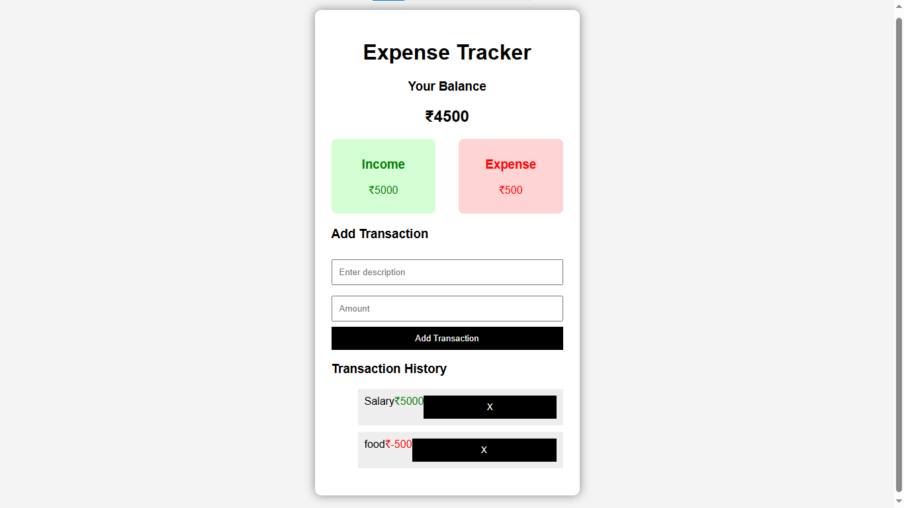

# Expense Tracker 💰

A responsive web-based **Expense Tracker application** built using **HTML, CSS, and JavaScript**.

This application helps users manage their daily income and expenses, calculate their current balance, and save transaction data using **Browser Local Storage**.

---

## 🚀 Live Demo

[View Expense Tracker](https://azfareen-yusraa.github.io/Expense-Tracker/)

---

## ✨ Features

* ✅ Add income transactions
* ✅ Add expense transactions
* ✅ Delete transactions
* ✅ Automatically calculate total balance
* ✅ Display total income
* ✅ Display total expenses
* ✅ Store data using Local Storage
* ✅ Data remains saved after refreshing the page
* ✅ Responsive user interface

---

## 🛠️ Technologies Used

* HTML5
* CSS3
* JavaScript
* Local Storage

---

## 📸 Screenshot



---

## 📂 Project Structure

```
Expense-Tracker
│
├── index.html        # Main HTML structure
├── style.css         # Styling and layout
├── script.js         # Application logic
├── screenshot.png    # Project preview image
├── README.md         # Project documentation
└── .gitignore        # Ignored files
```

---

## ▶️ How to Run Locally

Follow these steps to run the project on your computer:

### 1. Clone the repository

```bash
git clone https://github.com/Azfareen-Yusraa/Expense-Tracker.git
```

### 2. Open the project folder

```bash
cd Expense-Tracker
```

### 3. Run the application

Open `index.html` in your browser or use the **Live Server** extension in VS Code.

---

## 💾 Data Storage

This project uses **Local Storage** to save transaction data directly in the browser.

Your transactions remain available even after refreshing or reopening the website.

---

## 👩‍💻 Author

**Yusraa Azfareen**

GitHub:
https://github.com/Azfareen-Yusraa

---

## 📌 Future Improvements

* Add expense categories
* Add charts and analytics
* Add dark mode
* Add transaction date tracking
* Add backend database support
