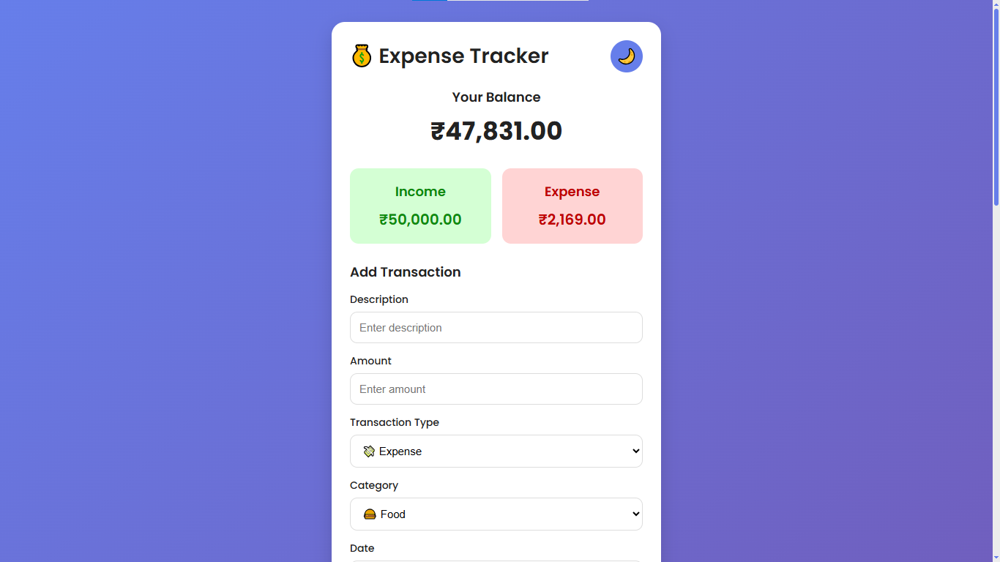
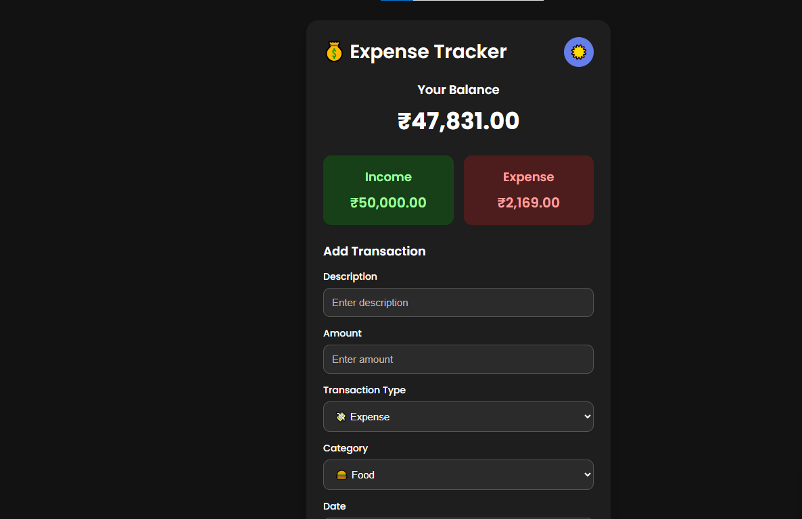
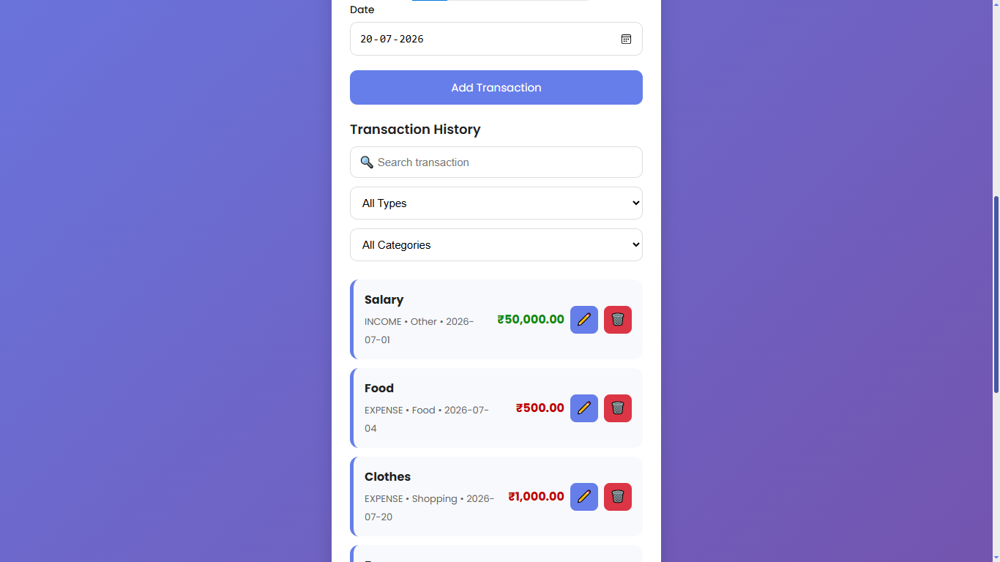
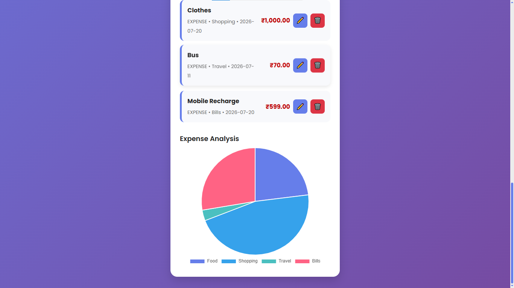

# 💰 Expense Tracker

A modern and responsive **Expense Tracker** built using **HTML, CSS, and JavaScript**. This application helps users manage their income and expenses, track their financial balance, and visualize spending through interactive charts.

---

## 🌟 Highlights

- 💰 Add, Edit & Delete Transactions
- 🔍 Search & Filter Transactions
- 🌙 Dark Mode with Theme Persistence
- 📊 Interactive Expense Analysis using Chart.js
- 💾 Local Storage Support
- 📱 Fully Responsive Design
- ♿ Accessibility Improvements

---

## 📸 Screenshots

### Home



### Dark Mode



### Search & Filters



### Expense Chart


---

## 🚀 Live Demo

👉 **[View Live Demo](https://azfareen-yusraa.github.io/Expense-Tracker/)**

---

## ✨ Features

* ➕ Add Income & Expense Transactions
* ✏️ Edit Existing Transactions
* 🗑️ Delete Transactions
* 🔍 Search Transactions
* 🏷️ Filter by Transaction Type
* 📂 Filter by Category
* 📅 Date Selection
* 💰 Automatic Balance Calculation
* 📊 Expense Analysis using Chart.js
* 🌙 Dark Mode with Theme Persistence
* 💾 Local Storage Support
* 📱 Fully Responsive Design
* ⌨️ Keyboard Shortcuts

  * **Ctrl + Enter** → Submit Transaction
  * **Esc** → Cancel Editing
* ♿ Accessibility Improvements

---

## 🛠️ Built With

* HTML5
* CSS3
* JavaScript (ES6+)
* Chart.js
* Local Storage API

---

## 📂 Project Structure

```
Expense-Tracker/
│
├── index.html
├── style.css
├── script.js
├── README.md
│
└── images/
├── home.png
├── dark-mode.png
├── search-filter.png
├── chart.png
```

---

## 📖 How to Run

1. Clone the repository

```bash
git clone https://github.com/Azfareen-Yusraa/Expense-Tracker.git
```

2. Open the project folder.

3. Open `index.html` in your browser.

No installation is required.

---

## 🎯 Features in Detail

### 💵 Transaction Management

* Add new transactions
* Edit existing transactions
* Delete transactions
* Categorize transactions
* Track income and expenses separately

### 📈 Financial Summary

* Total Balance
* Total Income
* Total Expenses

### 🔍 Smart Filtering

* Search by description
* Filter by transaction type
* Filter by category

### 📊 Expense Analysis

Interactive Pie Chart showing expenses grouped by category.

### 🌙 Dark Mode

* One-click theme switching
* Automatically remembers the selected theme

### 💾 Data Persistence

All transactions and preferences are stored using the browser's Local Storage.

---

## 📱 Responsive Design

The application works smoothly on:

* 💻 Desktop
* 💼 Laptop
* 📱 Mobile
* 📲 Tablet

---

## 📚 What I Learned

While building this project, I practiced:

* DOM Manipulation
* Event Handling
* JavaScript Arrays
* Objects
* Local Storage
* CRUD Operations
* Responsive Web Design
* CSS Variables
* Dark Mode Implementation
* Data Visualization with Chart.js
* Accessibility Best Practices

---

## 🔮 Future Improvements

* Export transactions to CSV
* Monthly Expense Reports
* Budget Planner
* Multiple Currency Support
* User Authentication
* Cloud Data Synchronization
* Recurring Transactions
* Expense Analytics Dashboard

---

## 🤝 Contributing

Contributions, suggestions, and improvements are welcome.

Feel free to fork this repository and create a pull request.

---

## 👩‍💻 Author

**Yusraa Azfareen**

GitHub: [Azfareen-Yusraa](https://github.com/Azfareen-Yusraa)

LinkedIn: [Yusraa Azfareen](https://www.linkedin.com/in/yusraa-azfareen/)

---

## ⭐ Support

If you found this project helpful, consider giving it a ⭐ on GitHub.

It helps others discover the project and motivates future improvements.

## 📄 License

This project is licensed under the MIT License.